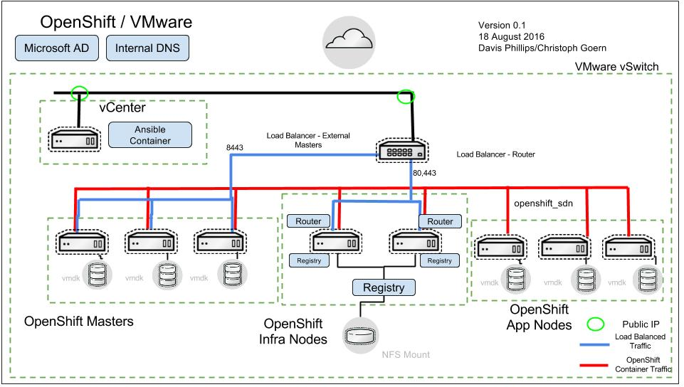

# The Reference Architecture OpenShift on VMware
This repository contains the scripts used to deploy an OpenShift environment based off of the Reference Architecture Guide for OpenShift 3.2 on VMware

## Overview
The repository contains Ansible playbooks which deploy 3 Masters, 2 infrastructure nodes and 3 application nodes. All nodes could utilize anti-affinity rules to separate them on the number of hypervisors you have allocated for this deployment. The playbooks deploy a Docker registry and scale the router to the number of Infrastruture nodes.



## Prerequisites
Internal DNS should be set up to reflect the number of nodes in the environment. The default VM network should have a DHCP server set up for initial provisioning. Lastly, in the var/infrastructure.yaml ip information should also be provided for the nodes in question. Here, VM guest names and other items can be customized.

### OpenShift Playbooks
The code in this repository handles all of the VMware specific components except for the installation of OpenShift. We rely on the OpenShift playbooks from the openshift-ansible-playbooks rpm. You will need the rpm installed on the workstation before using ose-on-aws.py.

```
subscription-manager repos --enable rhel-7-server-optional-rpms
subscription-manager repos --enable rhel-7-server-ose-3.2-rpms
rpm -Uvh https://dl.fedoraproject.org/pub/epel/epel-release-latest-7.noarch.rpm*
yum -y install atomic-openshift-utils \
                 python2-boto \
                 git \
                 python-netaddr \
                 python-httplib2

git clone https://github.com/dannvix/pySphere && cd pySphere/ && python setup.py install
git clone https://github.com/vmware/pyvmomi && cd pyvmomi/ && python setup.py install

# Grabbed the patched vsphere_guest until the PR is merged
cp vsphere_guest.py /usr/lib/python2.7/site-packages/ansible/modules/core/cloud/vmware/
```
Alternatively, I've provided a Dockerfile should you want to use a container for deployment. This
is the method that the reference implementation uses.

```
FROM registry.access.redhat.com/rhel7

MAINTAINER Davis Phillips <dphillip@redhat.com>


RUN yum -y --disablerepo=\* --enablerepo=rhel-7-server-rpms install yum-utils && \
  yum-config-manager --disable \* && \
  yum-config-manager --enable rhel-7-server-rpms && \
  yum-config-manager --enable rhel-7-server-extras-rpms  && \
  yum-config-manager --enable rhel-7-server-ose-3.2-rpms && \
  yum-config-manager --enable rhel-7-server-satellite-tools-6.2-rpms && \
  yum-config-manager --enable rhel-7-server-optional-rpms && \
  yum clean all


# install all that is required to use http://docs.ansible.com/ansible/vsphere_guest_module.html
RUN yum install -y --setopt=tsflags=nodocs atomic-openshift-utils git python-netaddr python-pip pyOpenSSL && \
    yum clean all

RUN rm /etc/ansible/hosts
RUN git clone https://github.com/dannvix/pySphere && cd pySphere/ && python setup.py install
RUN git clone https://github.com/vmware/pyvmomi && cd pyvmomi/ && python setup.py install

VOLUME [ "/etc/ansible/hosts", "/opt/ansible" ]

# Add in patched version of vsphere_guest.py
# Awaiting PR merge
COPY vsphere_guest.py /usr/lib/python2.7/site-packages/ansible/modules/core/cloud/vmware/
#COPY vi_virtual_machine.py /usr/lib/python2.7/site-packages/pysphere/
WORKDIR "/opt/ansible"

ENTRYPOINT [ "ansible-playbook" ]

```

## Usage
The Ansible script will launch infrastructure and flow straight into installing the OpenShift application and components.

### Before Launching the Ansible script
Before launching the ansible scripts ensure that your ssh keys are imported properly. Your private key should be located here ssh_keys/ose3-installer. Make sure your public key is copied to your template.
```
ssh-keygen

cp ~/.ssh/id_rsa ose-on-vmware/vmware-ansible/ssh_key/ose3-installer

```

### VMware Template Name
This is your VMware template name. The template should be configured with open-vm-tools installed on RHEL 7.2. The deployment assumes that initially DHCP will be configured. Once the new VM is started with vmtoolsd running, we extract out the DHCP address then use our infrastructure vars for the static ip addresses to use.

### New AWS Environment (Greenfield)
When installing all components into your VMware environment perform the following.   This will create the haproxy, the nfs server for the registry, and all the production OpenShift VMs. Additionally, the installer script will attempt to copy your existing public key to the VMs.
```
./ose-on-vmware.py --vcenter_host=my_vcenter_host --vcenter_username="administrator@vsphere.local" --vcenter_password="***" --vcenter_template_name=ose3-server-template-2.0.2 --rhsm-user=rh-user --rhsm-password=password --public-hosted-zone=vcenter.e2e.bos.redhat.com --vm_dns=4.4.4.4 --vm_gw=10.0.0.1 --vm_interface_name=eth0
```

### Existing VM Environment and Deployment (Brownfield)
If you are installing OpenShift into an existing VMware environment with your own VMs, this is how to accomplish that. The playbooks look for VMware annotations. App nodes will be labeled "app", infra nodes labeled "infra" and master nodes labeled as "master."

The ose-install tag will install OpenShift on your pre-existing environment. The dynamic inventory script sorts your VMs by their annotations and that is how the proper OpenShift labels are applied.

The ose-configure will configured your persistent registry and scale your nodes.

Lastly, the ose-demo tag will deploy a sample application and test cluster health.

Notice in the instance below we are supplying our own external NFS server and load balancer.
```
./ose-on-vmware.py --vcenter_host=my_vcenter_host --vcenter_username="administrator@vsphere.local" --vcenter_password="***" --vcenter_template_name=ose3-server-template-2.0.2 --rhsm-user=rh-user --rhsm-password=password --public-hosted-zone=vcenter.e2e.bos.redhat.com --vm_dns=4.4.4.4 --vm_gw=10.0.0.1 --vm_interface_name=eth0 --byo_lb=yes --lb_fqdn=loadbalancer.yourorg.com --byo_nfs=yes --nfs_registry_host=your_nfsserver.yourorg.com --nfs_registry_mountpoint=/registry --tag ose-install,ose-configure,ose-demo
```
